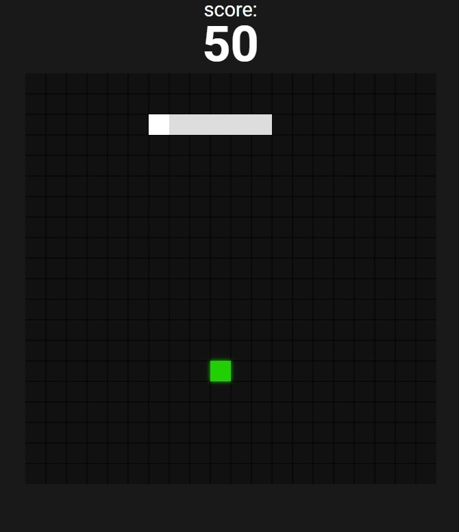
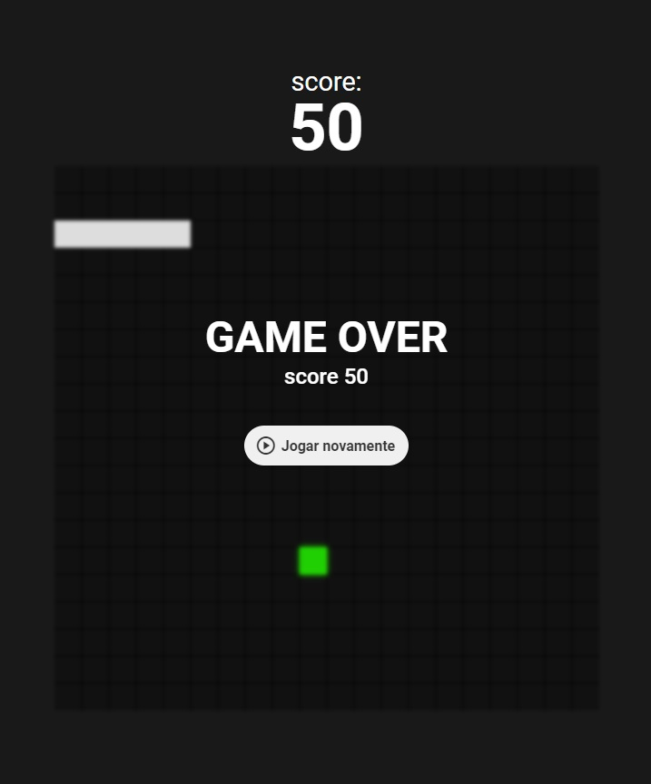

# SnakeRetroGame

    
    

## 💻 Project

This project is a snake game made in vscode, it has sound both when the snake eats the item and when the snake hits the walls. It's beautiful and interactive

## 🧪 Development

This game developed using HTML, CSS, JS.
